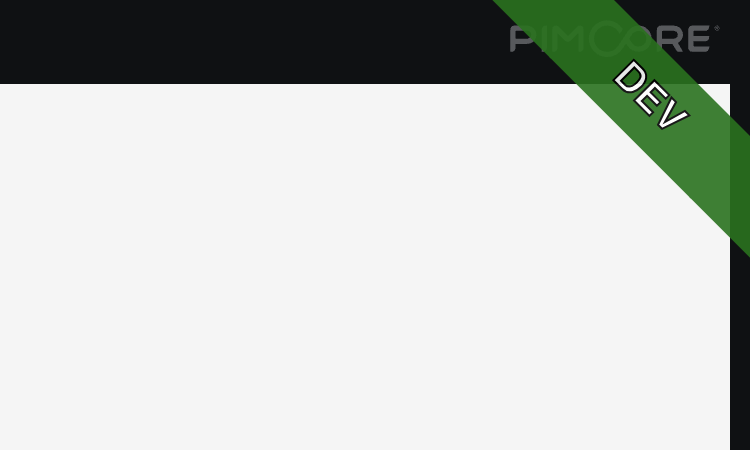

# Pimcore Plugin System Banner

This plugin will show a banner on the top right with the environment name.

* development environments = green
* test environments = purple
* stage environments = yellow
* prod environments = red

### Classic UI



### Studio UI


The environment is read from the `APP_ENV` variable.

## Version information

| Bundle Version | PHP  | Pimcore | Studio  |
|:--------------:|:----:|:-------:|:-------:|
|    &lt; 2.0    | ^7.3 |  ^6.0   |         |
|   &gt;= 2.0    | ^8.0 |  ^10.0  |         |
|   &gt;= 3.0    | ^8.1 |  ^11.0  |         |
|   &gt;= 4.0    | ^8.3 |  ^12.0  |         |
|   &gt;= 5.0    | ^8.3 |  ^12.0  | &check; |

## Installation

```
composer require basilicom/pimcore-plugin-system-banner
```


### Activate Plugin

* Add to config/bundles.php
``` 
return [
    ...
    PimcorePluginSystemBannerBundle::class => ['all' => true],
];

```

or

* Activate in the Pimcore backend in Tools -> Bundles & Bricks

### Install assets
for Pimcore >= 10

```bin/console assets:install public --symlink --relative```


for lower than Pimcore X respectively lower than Symfony 5

```bin/console assets:install web --symlink --relative```

## Customize the env name and color
You can customize the display of the name in the .env file (or .env.local); by default, it uses the `APP_ENV`. Use the following variable:
```
SYSTEM_BANNER_TEXT="My env name"
```
To customize the color (only three or six digits hex values are allowed, e.g., #000000), you can use the following variable:
```
SYSTEM_BANNER_COLOR="#ff0000"
```
By default, the plugin will set the color based on `APP_ENV`:
```
[
    'prod' => 'red',
    'production' => 'red',
    'stage' => 'yellow',
    'staging' => 'yellow',
    'dev' => 'green',
    'development' => 'green',
    'test' => 'purple',
    'testing' => 'purple'
];
```
