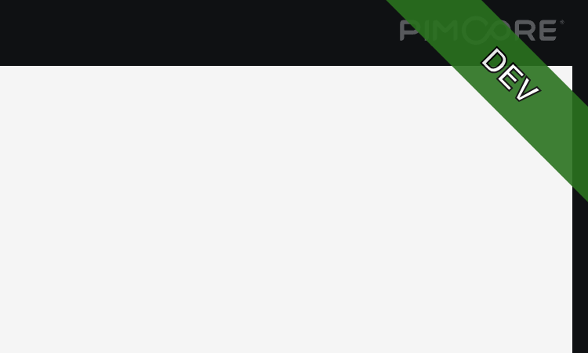
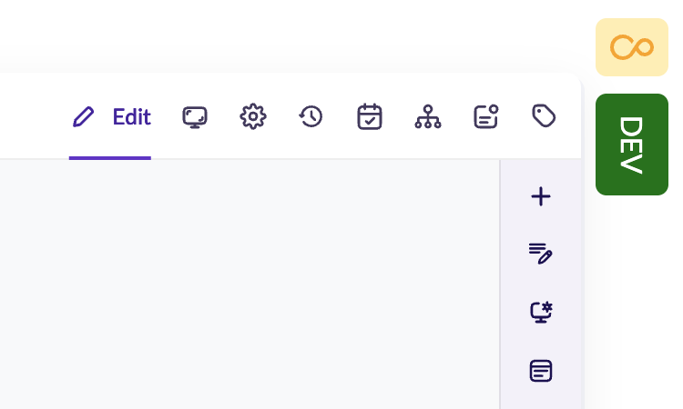

# Pimcore Plugin System Banner

This plugin will show a banner on the top right with the environment name, coloured by `APP_ENV`:

| `APP_ENV`              | Colour |
|------------------------|:------:|
| `dev`, `development`   |   🟢   |
| `test`, `testing`      |   🟣   |
| `stage`, `staging`     |   🟡   |
| `prod`, `production`   |   🔴   |
| anything else          |   ⚪   |

### Classic UI



### Studio UI



The environment is read from the `APP_ENV` variable.

## Version information

| Bundle Version | PHP  |        Pimcore         | Classic UI | Studio UI |
|:--------------:|:----:|:----------------------:|:----------:|:---------:|
|    &lt; 2.0    | ^7.3 |          ^6.0          |  &check;   |           |
|   &gt;= 2.0    | ^8.0 |         ^10.0          |  &check;   |           |
|   &gt;= 3.0    | ^8.1 |         ^11.0          |  &check;   |           |
|   &gt;= 4.0    | ^8.3 |         ^12.0          |  &check;   |           |
|   &gt;= 5.0    | ^8.1 | ^11.0, ^12.0, ^2026.1  |  &check;   |  &check;  |

Both UIs are detected at runtime, no configuration needed:

* Classic UI assets are registered through the Pimcore bundle manager events, so they only load where
  `pimcore/admin-ui-classic-bundle` is present. Pimcore 2026 dropped the classic UI.
* The Studio UI plugin is only registered when `pimcore/studio-ui-bundle` is installed
  (`^2025.4` on Pimcore 12, `^2026.1` on Pimcore 2026). It is built against Studio 2026.2.

## Installation

```
composer require basilicom/pimcore-plugin-system-banner
```


### Activate Plugin

* Add to config/bundles.php
``` 
return [
    ...
    PimcorePluginSystemBannerBundle::class => ['all' => true],
];

```

or

* Activate in the Pimcore backend in Tools -> Bundles & Bricks

### Install assets
for Pimcore >= 10

```bin/console assets:install public --symlink --relative```


for lower than Pimcore X respectively lower than Symfony 5

```bin/console assets:install web --symlink --relative```

## Customize the env name and color
You can customize the display of the name in the .env file (or .env.local); by default, it uses the `APP_ENV`. Use the following variable:
```
SYSTEM_BANNER_TEXT="My env name"
```
To customize the colour, you can use the following variable:
```
SYSTEM_BANNER_COLOR="#ff0000"
```
It accepts a three or six digit hex value, or one of 🟢 🟡 🔴 🟣 🔵.
Anything else is ignored and the `APP_ENV` colour from the table above is used.

## Show the banner on the login screen
By default the banner is only shown after login. To show it on the classic UI login screen as well, set:
```
SYSTEM_BANNER_LOGIN_SCREEN=true
```
The banner is rendered server-side into the login page (via the `pimcore.admin.login.beforeRender` event),
so it uses the same text and colour as above. The Studio UI login screen is not covered.

> [!CAUTION]
> The login page is public: with this option on, **anyone** who opens it sees the environment name (and your `SYSTEM_BANNER_TEXT`).
> Meant for local and internal environments — do not enable it on publicly reachable systems such as production.
